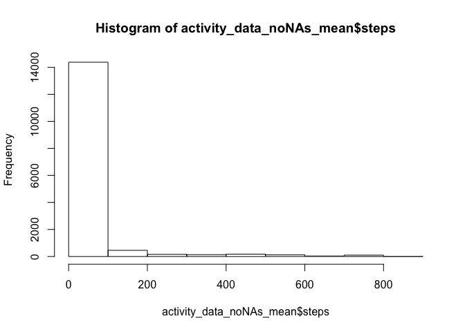

# Reproducible Research: Peer Assessment 1

## Loading and preprocessing the data

```r
activity_data <- read.csv("activity.csv")
```

## What is mean total number of steps taken per day?

* Make a histogram of the total number of steps taken each day


```r
steps_by_date <- aggregate(steps~date,activity_data,sum)
hist(steps_by_date$steps,breaks=10)
```

<!-- -->

* Calculate and report the **mean** and **median** total number of steps taken per day


```r
mean(steps_by_date$steps)
```

```
## [1] 10766.19
```

```r
median(steps_by_date$steps)
```

```
## [1] 10765
```

## What is the average daily activity pattern?

* Make a time series plot (i.e. type = "l") of the 5-minute interval (x-axis) and the average number of steps taken, averaged across all days (y-axis)


```r
steps_by_interval <- aggregate(steps ~ interval, activity_data, mean)
plot(steps_by_interval$interval, steps_by_interval$steps, type="l")
```

<!-- -->

* Which 5-minute interval, on average across all the days in the dataset, contains the maximum number of steps?


```r
steps_by_interval$interval[which.max(steps_by_interval$steps)]
```

```
## [1] 835
```

## Imputing missing values

* Calculate and report the total number of missing values in the dataset (i.e. the total number of rows with NAs)


```r
sum(is.na(activity_data$steps))
```

```
## [1] 2304
```
* Filling in all of the missing values in the dataset. Create a new dataset that is equal to the original dataset but with the missing data filled in.

**Stategy 1: Fill missing values with zero.**


```r
activity_data_noNAs <- activity_data
activity_data_noNAs[is.na(activity_data_noNAs$steps), "steps"] <- 0

steps_by_date_noNAs <- aggregate(steps~date,activity_data_noNAs,sum)

hist(steps_by_date_noNAs$steps,breaks=10)
```

<!-- -->
**Strategy 2: Use mean for the missing steps.**


```r
activity_data_noNAs_mean <- activity_data

for (i in seq(0, 2355, by=5)) {
  activity_data_noNAs_mean[is.na(activity_data_noNAs_mean[activity_data_noNAs_mean$interval == i,]$steps), "steps"] <- steps_by_interval[steps_by_interval$interval == i,]$steps
}

steps_by_date_noNAs_mean <- aggregate(steps~date,activity_data_noNAs_mean,sum)

hist(activity_data_noNAs_mean$steps,breaks=10)
```

<!-- -->


## Are there differences in activity patterns between weekdays and weekends?
