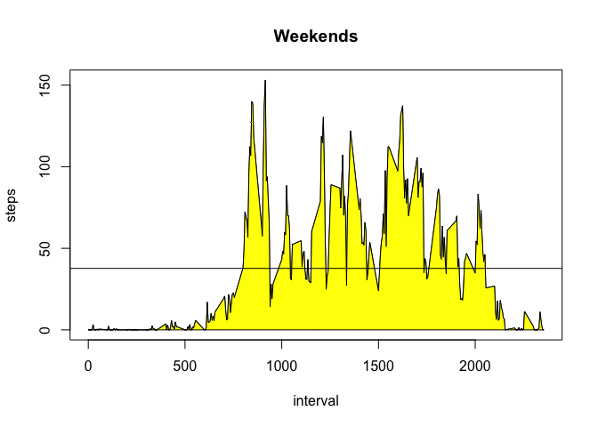

# Reproducible Research: Peer Assessment 1

## Loading and preprocessing the data

```r
activity_data <- read.csv("activity.csv")
```

## What is mean total number of steps taken per day?

* Make a histogram of the total number of steps taken each day


```r
steps_by_date <- aggregate(steps~date,activity_data,sum)
hist(steps_by_date$steps,breaks=10,main="Steps by day", xlab = "Steps", col = "orange")
```

<!-- -->

* Calculate and report the **mean** and **median** total number of steps taken per day


```r
mean(steps_by_date$steps)
```

```
## [1] 10766.19
```

```r
median(steps_by_date$steps)
```

```
## [1] 10765
```

## What is the average daily activity pattern?

* Make a time series plot (i.e. type = "l") of the 5-minute interval (x-axis) and the average number of steps taken, averaged across all days (y-axis)


```r
steps_by_interval <- aggregate(steps ~ interval, activity_data, mean)
max_interval <- steps_by_interval$interval[which.max(steps_by_interval$steps)]
plot(steps_by_interval$interval, steps_by_interval$steps, col='orange', type="l", xlab = "5 minute interval", ylab = "Average steps", main = "Average Daily Steps")
xx <- c(steps_by_interval$interval, rev(steps_by_interval$interval))
yy <- c(rep(0, nrow(steps_by_interval)), rev(steps_by_interval$steps))
polygon(xx, yy, col='orange')
```

<!-- -->

* Which 5-minute interval, on average across all the days in the dataset, contains the maximum number of steps?


```r
steps_by_interval$interval[which.max(steps_by_interval$steps)]
```

```
## [1] 835
```

* Interval 835 contains the maximum numbers of steps.

## Imputing missing values

* Calculate and report the total number of missing values in the dataset (i.e. the total number of rows with NAs)


```r
sum(is.na(activity_data$steps))
```

```
## [1] 2304
```

* The data set contains 2304 missing step values.

* Filling in all of the missing values in the dataset. Create a new dataset that is equal to the original dataset but with the missing data filled in.

**Stategy: Fill missing values with zero.**


```r
activity_data_noNAs <- activity_data
activity_data_noNAs[is.na(activity_data_noNAs$steps), "steps"] <- 0

steps_by_date_noNAs <- aggregate(steps~date,activity_data_noNAs,sum)

hist(steps_by_date_noNAs$steps,breaks=10,main="Steps by day", xlab = "Steps", col = "purple")
```

<!-- -->

* Replacing missing values with zeros causes the histogram to have more left most values.

## Are there differences in activity patterns between weekdays and weekends?

* Create a new factor variable in the dataset with two levels -- "weekday" and "weekend" indicating whether a given date is a weekday or weekend day.


```r
activity_data_noNAs$day_number <- as.POSIXlt(activity_data_noNAs$date)$wday
activity_data_noNAs$day_type <- as.factor(ifelse(activity_data_noNAs$day_number == 0 | activity_data_noNAs$day_number == 6, "weekend", "weekday"))

weekday_steps <- activity_data_noNAs[activity_data_noNAs$day_type == "weekday",]
weekend_steps <- activity_data_noNAs[activity_data_noNAs$day_type == "weekend",]
```

* Make a panel plot containing a time series plot (i.e. type = "l") of the 5-minute interval (x-axis) and the average number of steps taken, averaged across all weekday days or weekend days (y-axis).


```r
steps_by_interval_weekdays <- aggregate(steps ~ interval, weekday_steps, mean)
steps_by_interval_weekends <- aggregate(steps ~ interval, weekend_steps, mean)

weekday_mean_steps = mean(steps_by_interval_weekdays$steps)
plot(steps_by_interval_weekdays, type = "l", main = "Weekdays")
abline(h=weekday_mean_steps)
```

<!-- -->

```r
weekend_mean_steps = mean(steps_by_interval_weekends$steps)
plot(steps_by_interval_weekends, type = "l", main = "Weekends")
abline(h=weekend_mean_steps)
```

<!-- -->

* In general, people are more active on the weekends as seen by mean numbers of steps between weekdays (30.6262346) and weekends (37.6935764).  Also people tend to sleep in later on weekends as there less steps taken between intervals 500 to 750 (~ 8am to noon).
